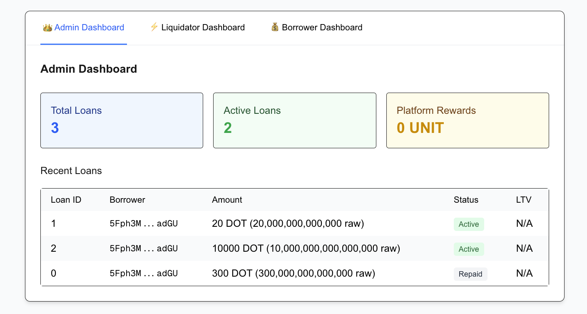
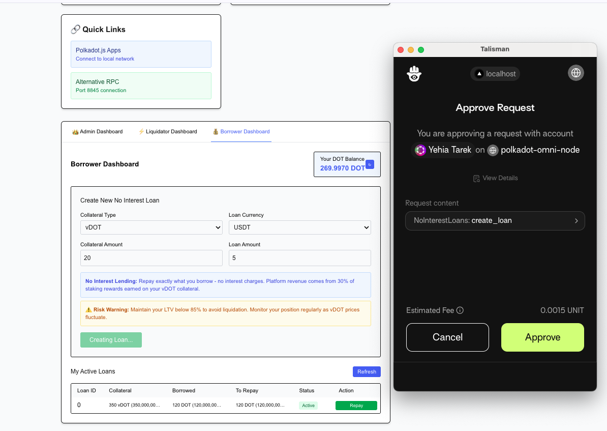
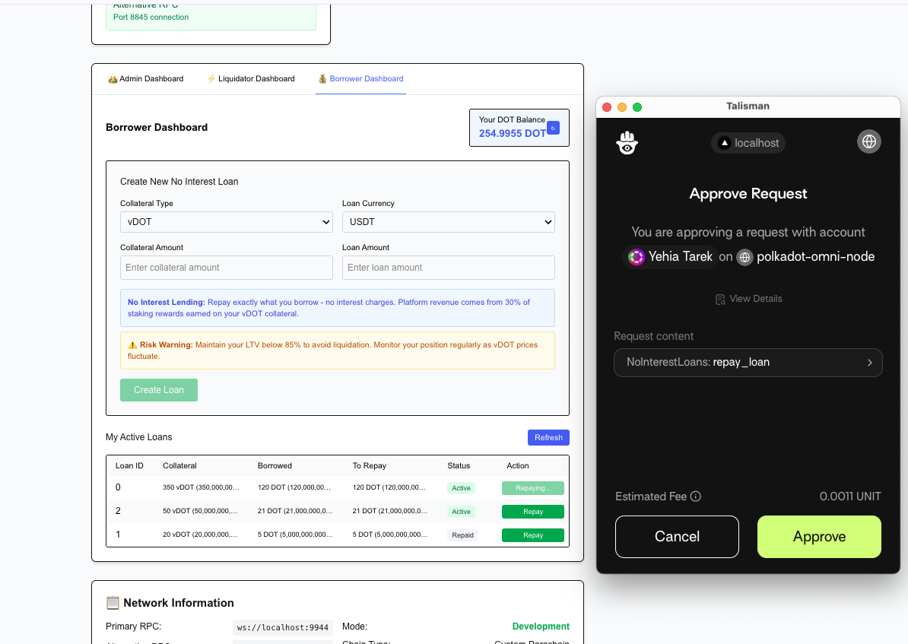
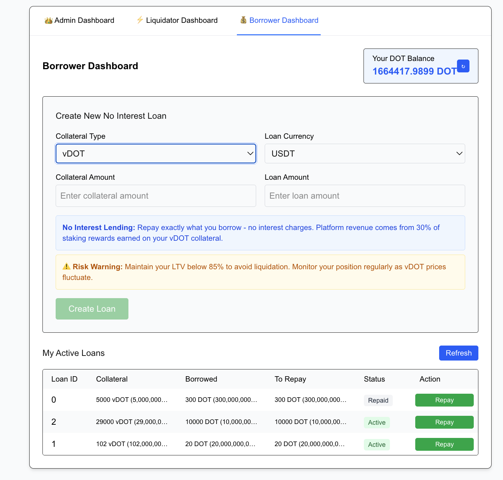
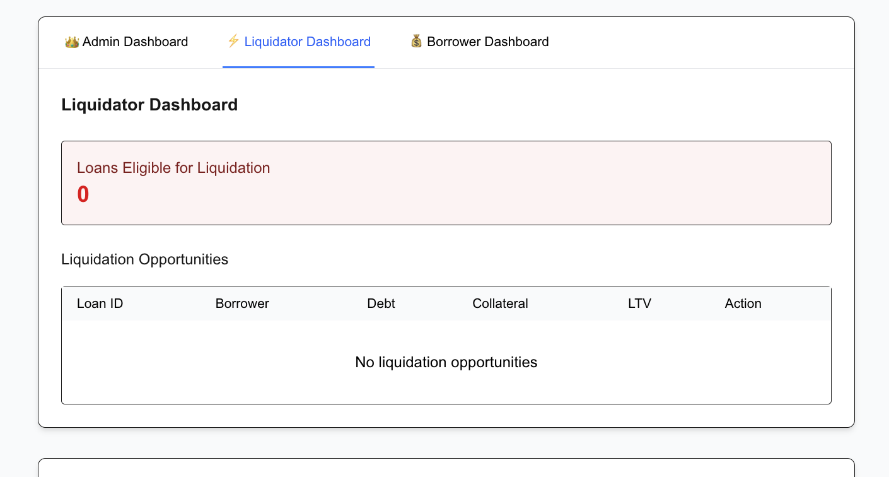
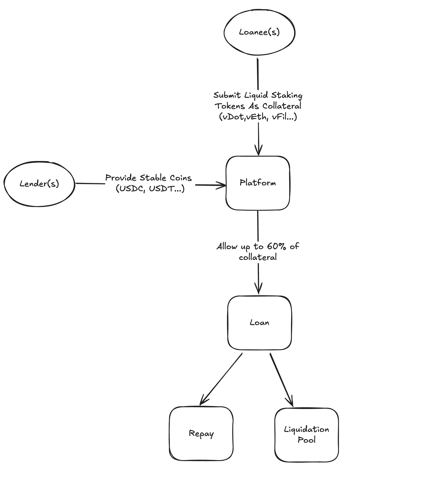
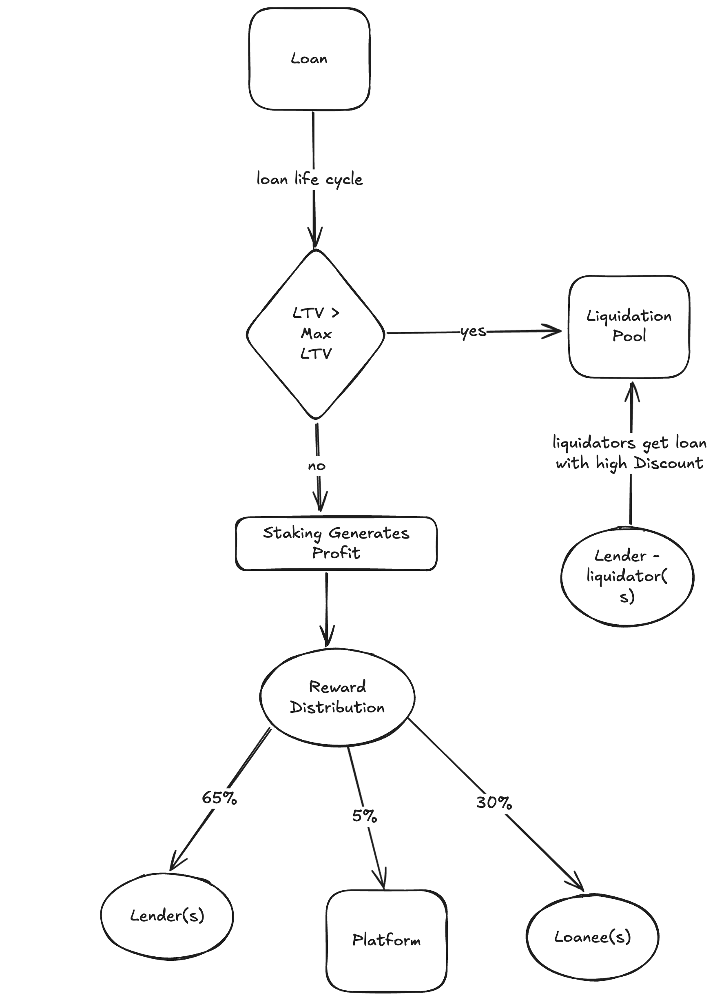

<a href="https://bifrost.io"></a>

<a href="https://bifrost.io"></a>

<br />

<h1 align="left">No Interest Loans</a></h1>

## Overview
Increase the liquidity potential of liquid staking tokens (such as vDOT) through access to stablecoin loans, encouraging users to remain staked while borrowing against their positions. Our model prioritizes safety and stability across all participants: lenders, borrowers, and liquidators.

## Problem statement
As we try to break of the cycle of infinite debt, where time spent paying off the debt only increases the debt and burdens the loanee, we endeavour to establish a more collaborative solution.

## Motivation
Our mission is to create a platform that encourages staking DOT, and then fruther staking vDOT in exchange for loans in the form of stable coin. The loanee gets to enjoy the perks of staking their assets, gaining periodical rewards on them, while simulataneously getting money to invest in further endeavours. The platform and the loaner earn a share of the periodical rewards, and the only condition is that if the staked assets' value goes near below that of the loan (with a safe margin), the assets' will be up for sale at a low price; Anyone(liquidator) who can pay back the loan, will buy the assets for cheap.

## User base
  - **Loanee**
  <br />User enjoys stable coin, invests, earns, returns.
    - User gets stable coin, and transfers vDOT as collateral.
    - User earns a percentage of their staked DOT rewards.
    - User may return the loan, and get their vDOT back.
  - **Loaner**
  <br />User offers stable coin, gains low risk rewards.
    - User pays stable coin as a loan to another user.
    - User earns rewards on vDOT of a value more than the loan they gave.
    - User simply stops gaining rewards after the loan is paid back.
    - User gets a guarantee of stable coin return.
  - **Liquidator**
  <br />User offers to pay back a loan in exchange for discounted vDOT.
    - User looks at the liquidation pool 
    - User picks loans to pay back and earn the collateral at a discounted price.

*Please note that the platform is a user that offers loans in addition to earning a percentage of rewards from all active loans.*

## Functionality overview
### Admin:

View loans, their status, and rewards.

<div>
  
</div>
<br><br>

### Loanee/Borrower:

Connect your wallet, create loans:

<div>
  
</div>
<br>

Repay loans:

<div>
  
</div>
<br>

Rewards are gained and distributed automatically.

<div>
  
</div>
<br><br>

### Liquidator:
View loans available for liquidation, make your deals, repay loans and gain liquid staking tokens.

<div>
  
</div>
<br>

For more details, please refer to the frontend [repo](https://github.com/yehia67/bifrost-no-intrests-loans-frontend).
<br>
## Architecture overview
### Platform overview

<div>
  
</div>
<br><br>

### Loans overview

<div>
  
</div>
<br><br>

## Vision
The current version of the platform only supports one loaner -the platform itself. As the platform grows, it will support the role of the loaner. Anyone can give loans and assume our role, and the platform's share of the rewards would be reduced to a small amount, earning the loaner the rewards on staked tokens of higher value than the loan they're offering. Loans will be self managed entities, utilizing the chain for secure, reliable, fast transactions.
<!-- 
<h4>🐣 Supported by</h4> -->

<!-- <p align="left">
  <a href="https://web3.foundation/grants"></a>
  <a href="https://www.substrate.io/builders-program"></a>
  <a href="https://bootcamp.web3.foundation/"></a>
</p> -->

<!-- [](https://app.bifrost.io)
[](https://stats.bifrost.io)
[](https://discord.gg/bifrost-io)
[](https://x.com/Bifrost) -->

## Build the project
## Install Rust and required tools

```bash
curl https://sh.rustup.rs -sSf | sh
make init

```

## Build the Pallet

```bash
cargo build -p bifrost-no-interest-loans
```

## Format code

```sh
cargo fmt -p bifrost-no-interest-loans
```

## Lint code

```sh
cargo clippy -p bifrost-no-interest-loans
```

## Testing

```bash
cargo test -p bifrost-no-interest-loans
```

<!-- 
## Build binary

```bash
make build-all-release
```

## Format code

```sh
make format
```

## Lint code

```sh
make clippy
```

## Testing

```bash
make test-all
``` -->

<!-- ## Generate runtime weights

if runtime logic change we may do the benchmarking to regenerate WeightInfo for dispatch calls

```bash
make generate-all-weights
``` -->

<!-- ## Testing runtime migration

If modify the storage, should test the data migration before production upgrade.

```bash
# bifrost kusama
make try-kusama-runtime-upgrade

# bifrost polkadot
make try-polkadot-runtime-upgrade
```

## Run development chain

run node with `--chain=bifrost-polkadot-dev` to enable development mode.

Before use dev mode, modify OnTimestampSet to be ()

```rust
impl pallet_timestamp::Config for Runtime {
	type MinimumPeriod = ConstU64<{ SLOT_DURATION / 2 }>;
	/// A timestamp: milliseconds since the unix epoch.
	type Moment = Moment;
   -type OnTimestampSet = Aura;
   +type OnTimestampSet = ();
	type WeightInfo = pallet_timestamp::weights::SubstrateWeight<Runtime>;
}

```

## Run local testnet with polkadot-launch

### Install `polkadot-launch`

```bash
yarn global add polkadot-launch
cd -
```

### Build polkadot

```bash
# replace version with your target polkadot version
cargo install --git https://github.com/paritytech/polkadot --tag <version> polkadot --locked
```

### Launch Polkadot and the parachain

```bash
cd -
polkadot-launch ./scripts/bifrost-launch.json
```

It will take about 1-2 minutes for the parachain to start producing blocks.

## Run local testnet with parachain-launch

### Install `parachain-launch`

```sh
yarn global add @open-web3/parachain-launch
```

### Generate docker files

```sh
parachain-launch generate --config=scripts/bifrost-docker-launch.yml --yes
```

It will pull images and generate required docker files in a folder called `output` in your current working directory

### Start relaychain and parachain

To start the nodes, navigate to the output folder that the generated docker scripts in and start containers:

```sh
cd ./output
docker-compose up -d --build
```

## Run full node

### Create `bifrost-fullnode` directory, generate `node-key` and get `bifrost.json`

```sh
mkdir -p ~/node-key
subkey generate-node-key --file ~/node-key/bifrost.key
```

### Start full node

Replace your-fullnode-name

```sh
docker pull bifrostnetwork/bifrost:latest
docker run -d \
-v ~/node-key:/node-key \
-p 9944:9944 \
-p 9933:9933 \
-p 30333:30333 \
bifrostnetwork/bifrost:latest \
  --name your-fullnode-name \
  --base-path "/data" \
  --node-key-file "/node-key/bifrost.key" \
  --chain "/spec/bifrost.json" \
  --pruning=archive \
  --rpc-external \
  --ws-external \
  --rpc-cors all \
  --trie-cache-size 0 \
  --execution wasm
``` -->

## Challenges:
One of the major challenges we faced was working with bifrost and adding our pallet to runtime. We created an [issue](https://github.com/bifrost-io/bifrost/issues/1942) in hopes to find a solution. The workaround currently implemented in branch [standard-no-interest-loans](https://github.com/yehia67/bifrost-no-interest-loans/tree/standard-no-intrest-loan) works without bifrost. Once the issue is fixed, work will continue with bifrost.
